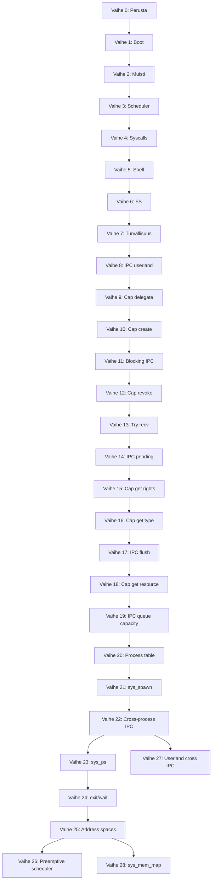

# Zinux — Kehitystiekartta

> Vaiheittainen suunnitelma tyhjästä bootattavaan hybridimikrokernel-käyttöjärjestelmään.
> Jokainen vaihe tuottaa **testattavan artefaktin** (QEMU boot + serial output).

---

## Vaihe 0 — Perusta ✅

| Tehtävä | Tila |
|---------|------|
| Arkkitehtuuridokumentaatio | ✅ |
| Ylidokumentointistandardi | ✅ |
| Projektirakenne & build.zig runko | ✅ |
| Limine + linker.ld konfiguraatio | ✅ |
| Dokumentoitu entry point -esimerkki | ✅ |

---

## Vaihe 1 — Boot & tulostus ✅

**Tavoite**: Kernel boottaa Liminessä, tulostaa "Zinux boot OK" UART/VGA:han.

| # | Tehtävä | Tiedosto | Tila |
|---|---------|----------|------|
| 1.1 | Limine request/response | `kernel/boot/limine_protocol.zig` | ✅ |
| 1.2 | `_start` entry + early stack | `kernel/boot/entry.zig` | ✅ |
| 1.3 | VGA text mode -ajuri | `kernel/drivers/video/vga.zig` | ✅ |
| 1.4 | UART COM1 debug -ajuri | `kernel/drivers/char/uart.zig` | ✅ |
| 1.5 | Log-moduuli (serial + vga) | `kernel/lib/log.zig` | ✅ |
| 1.6 | ISO-build + QEMU-run step | `build.zig` | ✅ |
| 1.7 | CI: boot-test "Zinux boot OK" | `.github/workflows/ci.yml` | ✅ |

**Testi**:
```bash
zig build iso && zig build run
# Odotettu serial: [Zinux] boot OK
```

---

## Vaihe 2 — Muistinhallinta ✅

**Tavoite**: Fyysinen ja virtuaalinen muistinhallinta toimii; kernel heap allokoi.

| # | Tehtävä | Tiedosto | Tila |
|---|---------|----------|------|
| 2.1 | GDT + TSS | `kernel/arch/x86_64/gdt.zig` | ✅ GDT (TSS myöhemmin) |
| 2.2 | IDT + keskeytyskäsittelijät | `kernel/arch/x86_64/idt.zig` | ✅ stub + #14 |
| 2.3 | 4-tasoinen sivutus | `kernel/arch/x86_64/paging.zig` | ✅ mapPage + mapPageEnsure |
| 2.4 | PMM bitmap-allokaattori | `kernel/mm/pmm.zig` | ✅ Limine map + host-testit |
| 2.5 | VMM sivukartoitus | `kernel/mm/vmm.zig` | ✅ PMM-sivutaulut + mapNewPageEnsure |
| 2.6 | Kernel heap (first-fit) | `kernel/mm/heap.zig` | ✅ heap_core + VMM-kasvu |
| 2.7 | Page fault -handler | `kernel/arch/x86_64/idt.zig` | ✅ CR2 + error code log |

**Testi**: Allokoi 100 kehystä, kartoita, kirjoita, lue — ei page faultia. ✅

**Boot**:
```bash
zig build run
# Odotettu serial:
# PMM initialized, PMM alloc test OK, VMM initialized, Heap initialized
# Memory map test OK (100 frames), Heap test OK, Zinux boot OK
```

---

## Vaihe 3 — Prosessit & aikataulutus ✅

**Tavoite**: Useita säikeitä, kontekstinvaihto, PIT-ajastin.

| # | Tehtävä | Tiedosto | Tila |
|---|---------|----------|------|
| 3.1 | CPU-konteksti (save/restore) | `kernel/arch/x86_64/context.zig` | ✅ RSP switch |
| 3.2 | Prosessi & säie -rakenteet | `kernel/sched/thread.zig` | ✅ stub |
| 3.3 | Round-robin scheduler | `kernel/sched/scheduler.zig` | ✅ coop ABAB-demo |
| 3.4 | PIT 8254 -ajastin | `kernel/drivers/timer/pit.zig` | ✅ |
| 3.5 | Timer IRQ → scheduler tick | `kernel/arch/x86_64/idt.zig` | ✅ PIT IRQ + Phase 3 timer ticks OK |
| 3.6 | SMP per-CPU init (Limine) | `kernel/boot/smp.zig` | ✅ CPU-määrä boot-logissa |

**Testi**: Kaksi säiettä vuorottelevat tulostusta → `ABAB...` serialissa ✅

---

## Vaihe 4 — Syscalls & IPC ✅

**Tavoite**: Käyttäjätilan prosessi voi kutsua kerneliä; capability-malli.

| # | Tehtävä | Tiedosto | Tila |
|---|---------|----------|------|
| 4.1 | Syscall entry (syscall/sysenter) | `kernel/arch/x86_64/syscall.zig` | ✅ STAR/LSTAR/SFMASK + entry.S |
| 4.2 | Syscall dispatch -taulu | `kernel/syscall/dispatch.zig` | ✅ write/exit/getpid + boot-testi |
| 4.3 | Capability-rakenne | `kernel/ipc/capability.zig` | ✅ create/delegate/revoke + boot-testi |
| 4.4 | IPC-portit (send/recv) | `kernel/ipc/port.zig` | ✅ rengasjono + cap send/recv + boot-testi |
| 4.5 | Ring 3 siirtymä | `kernel/arch/x86_64/usermode.zig` | ✅ iretq + SYSCALL hello + test_return |
| 4.6 | Jaettu ABI | `libs/zinuxabi.zig` | ✅ syscall-numerot + virhekoodit |

**Testi**: Ring 3 `sys_write("hello")` → serial + `Usermode test OK` ✅

---

## Vaihe 5 — Käyttäjätila ✅

**Tavoite**: Init-prosessi, shell, peruskomennot.

| # | Tehtävä | Tiedosto |
|---|---------|----------|
| 5.1 | ELF-loader kernelissä | `kernel/loader/elf.zig` | ✅ parse PT_LOAD + boot "elf" |
| 5.2 | init-prosessi | `userland/init/main.zig` | ✅ ELF load + "init\n" + Init process OK |
| 5.3 | Interaktiivinen shell | `userland/shell/main.zig` | ✅ prompt + help + Shell test OK |
| 5.4 | PS/2-näppäimistö | `kernel/drivers/char/keyboard.zig` | ✅ IRQ1 + Keyboard init/test OK |
| 5.5 | Komennot: help, meminfo, ps | `userland/shell/commands/` | ✅ SYS_meminfo/ps + boot test OK |

**Testi**: Boot → shell prompt `zinux> ` → `help` / `meminfo` / `ps` toimivat.

---

## Vaihe 6 — Ajurit & tiedostojärjestelmä ✅

**Tavoite**: PCI-enumerointi, virtio-blk, yksinkertainen FS.

| # | Tehtävä | Tiedosto |
|---|---------|----------|
| 6.1 | PCI bus scan | `kernel/drivers/bus/pci.zig` | ✅ config scan + PCI scan OK |
| 6.2 | VirtIO block -ajuri | `kernel/drivers/block/virtio_blk.zig` | ✅ PCI common cfg + VirtIO block read OK |
| 6.3 | VFS-rajapinta | `kernel/fs/vfs.zig` | ✅ mount + open/read/close + VFS test OK |
| 6.4 | tmpfs (RAM-pohjainen) | `kernel/fs/tmpfs.zig` | ✅ /tmp/welcome + tmpfs test OK |
| 6.5 | Käyttäjätilan ajurimalli | `userland/drivers/` | ✅ registry + null driver + Userland driver test OK |

---

## Vaihe 7 — Turvallisuus & kovennus ✅

| # | Tehtävä |
|---|---------|
| 7.1 | SMEP/SMAP aktivointi | ✅ CR4 + stac/clac + SMEP/SMAP hardening OK |
| 7.2 | Stack canaries kernelissä | ✅ early/syscall/TSS/thread + Stack canary OK |
| 7.3 | KASLR (satunnainen kernel-base) | ✅ RDTSC+HHDM heap slide + KASLR OK |
| 7.4 | Capability-audit logging | ✅ rengaspuskuri + Capability audit OK |
| 7.5 | Fuzzing: syscall-rajapinta | ✅ LCG fuzz + Syscall fuzz OK |

---

## Vaihe 8 — IPC käyttäjätilaan ✅

**Tavoite**: Ring 3 voi lähettää/vastaanottaa viestejä capability-slottien kautta syscallien avulla.

| # | Tehtävä | Tiedosto | Tila |
|---|---------|----------|------|
| 8.1 | sys_ipc_send / sys_ipc_recv | `kernel/syscall/dispatch.zig`, `ipc_syscall_core.zig` | ✅ invoke + IPC syscall OK |
| 8.2 | Userland IPC-kirjasto | `userland/lib/ipc.zig` | ✅ ring 3 send/recv + Userland IPC test OK |

**Testi**:
```bash
zig build run
# Odotettu serial: IPC syscall OK, userland ipc OK, Userland IPC test OK
```

---

## Vaihe 9 — Capability delegointi käyttäjätilaan ✅

**Tavoite**: Ring 3 voi delegoida capability-oikeuksia `sys_cap_delegate`-syscallilla.

| # | Tehtävä | Tiedosto | Tila |
|---|---------|----------|------|
| 9.1 | sys_cap_delegate | `kernel/syscall/dispatch.zig`, `cap_syscall_core.zig` | ✅ invoke + Cap syscall OK |
| 9.2 | Userland cap-kirjasto | `userland/lib/cap.zig` | ✅ ring 3 delegate + Userland cap test OK |

**Testi**:
```bash
zig build run
# Odotettu serial: Cap syscall OK, userland cap OK, Userland cap test OK
```

---

## Vaihe 10 — Capability-luonti käyttäjätilaan ✅

**Tavoite**: Ring 3 voi luoda uusia IPC-portti-capabilityja `sys_cap_create`-syscallilla.

| # | Tehtävä | Tiedosto | Tila |
|---|---------|----------|------|
| 10.1 | sys_cap_create | `kernel/syscall/dispatch.zig`, `cap_syscall_core.zig` | ✅ invoke + Cap create syscall OK |
| 10.2 | Userland cap.createPort | `userland/lib/cap.zig` | ✅ ring 3 create + Userland cap create test OK |

**Testi**:
```bash
zig build run
# Odotettu serial: Cap create syscall OK, userland cap create OK, Userland cap create test OK
```

---

## Vaihe 11 — Estävä IPC recv ✅

**Tavoite**: `sys_ipc_recv` blokkaa kun portin jono on tyhjä; timer IRQ herättää odottavan recv:n boot-testissä.

| # | Tehtävä | Tiedosto | Tila |
|---|---------|----------|------|
| 11.1 | Blocking recv + timer-wake | `kernel/syscall/ipc_block_core.zig`, `ipc_block.zig`, `dispatch.zig` | ✅ IPC block OK |
| 11.2 | Userland blocking ipc.recv | `userland/ipc_block_test/`, `ipc_block_userland.zig` | ✅ userland ipc block OK |

**Testi**:
```bash
zig build run
# Odotettu serial: IPC block OK, userland ipc block OK, Userland IPC block test OK
```

---

## Vaihe 12 — Capability peruutus käyttäjätilaan ✅

**Tavoite**: Ring 3 voi peruuttaa capability-slottinsa `sys_cap_revoke`-syscallilla.

| # | Tehtävä | Tiedosto | Tila |
|---|---------|----------|------|
| 12.1 | sys_cap_revoke | `kernel/syscall/dispatch.zig`, `capability_core.zig` | ✅ invoke + Cap revoke syscall OK |
| 12.2 | Userland cap.revoke | `userland/lib/cap.zig`, `userland/cap_revoke_test/` | ✅ ring 3 revoke + Userland cap revoke test OK |

**Testi**:
```bash
zig build run
# Odotettu serial: Cap revoke syscall OK, userland cap revoke OK, Userland cap revoke test OK
```

---

## Vaihe 13 — Non-blocking IPC recv ✅

**Tavoite**: Ring 3 voi kokeilla viestin vastaanottoa ilman blokkausta `sys_ipc_try_recv`-syscallilla (EAGAIN jos jono tyhjä).

| # | Tehtävä | Tiedosto | Tila |
|---|---------|----------|------|
| 13.1 | sys_ipc_try_recv | `kernel/syscall/dispatch.zig`, `ipc_try_recv_syscall.zig` | ✅ invoke + IPC try recv syscall OK |
| 13.2 | Userland ipc.tryRecv | `userland/lib/ipc.zig`, `userland/ipc_try_recv_test/` | ✅ ring 3 tryRecv + Userland IPC try recv test OK |

**Testi**:
```bash
zig build run
# Odotettu serial: IPC try recv syscall OK, userland ipc try recv OK, Userland IPC try recv test OK
```

---

## Vaihe 14 — IPC jonon syvyyskysely ✅

**Tavoite**: Ring 3 voi kysyä capability-slotin portin jonossa olevien viestien määrän `sys_ipc_pending`-syscallilla.

| # | Tehtävä | Tiedosto | Tila |
|---|---------|----------|------|
| 14.1 | sys_ipc_pending | `kernel/syscall/dispatch.zig`, `port.zig` | ✅ invoke + IPC pending syscall OK |
| 14.2 | Userland ipc.pending | `userland/lib/ipc.zig`, `userland/ipc_pending_test/` | ✅ ring 3 pending + Userland IPC pending test OK |

**Testi**:
```bash
zig build run
# Odotettu serial: IPC pending syscall OK, userland ipc pending OK, Userland IPC pending test OK
```

---

## Vaihe 15 — Capability oikeuskysely käyttäjätilaan ✅

**Tavoite**: Ring 3 voi lukea capability-slotin oikeusmaskin `sys_cap_get_rights`-syscallilla.

| # | Tehtävä | Tiedosto | Tila |
|---|---------|----------|------|
| 15.1 | sys_cap_get_rights | `kernel/syscall/dispatch.zig`, `cap_get_rights.zig` | ✅ invoke + Cap get rights syscall OK |
| 15.2 | Userland cap.getRights | `userland/lib/cap.zig`, `userland/cap_get_rights_test/` | ✅ ring 3 getRights + Userland cap get rights test OK |

**Testi**:
```bash
zig build run
# Odotettu serial: Cap get rights syscall OK, userland cap get rights OK, Userland cap get rights test OK
```

---

## Vaihe 16 — Capability tyyppikysely ja portin vapautus ✅

**Tavoite**: Ring 3 voi lukea capability-slotin tyypin `sys_cap_get_type`-syscallilla; portti-capabilityn peruutus vapauttaa IPC-portin.

| # | Tehtävä | Tiedosto | Tila |
|---|---------|----------|------|
| 16.1 | sys_cap_get_type + port destroy on revoke | `dispatch.zig`, `capability_core.zig`, `cap_get_type.zig` | ✅ Cap get type syscall OK |
| 16.2 | Userland cap.getType | `userland/lib/cap.zig`, `userland/cap_get_type_test/` | ✅ userland cap get type OK |

**Testi**:
```bash
zig build run
# Odotettu serial: Cap get type syscall OK, userland cap get type OK, Userland cap get type test OK
```

---

## Vaihe 17 — IPC portin jonon tyhjennys ✅

**Tavoite**: Ring 3 voi tyhjentää capability-slotin portin viestijonon `sys_ipc_flush`-syscallilla ilman recv:ää.

| # | Tehtävä | Tiedosto | Tila |
|---|---------|----------|------|
| 17.1 | sys_ipc_flush | `kernel/syscall/dispatch.zig`, `port_core.zig`, `ipc_flush_syscall.zig` | ✅ invoke + IPC flush syscall OK |
| 17.2 | Userland ipc.flush | `userland/lib/ipc.zig`, `userland/ipc_flush_test/` | ✅ userland ipc flush OK |

**Testi**:
```bash
zig build run
# Odotettu serial: IPC flush syscall OK, userland ipc flush OK, Userland IPC flush test OK
```

---

## Vaihe 18 — Capability resurssitunnisteen kysely ✅

**Tavoite**: Ring 3 voi lukea capability-slotin resurssitunnisteen (esim. port_id) `sys_cap_get_resource`-syscallilla; kysely vaatii read-oikeuden.

| # | Tehtävä | Tiedosto | Tila |
|---|---------|----------|------|
| 18.1 | sys_cap_get_resource | `dispatch.zig`, `capability_core.zig`, `cap_get_resource.zig` | ✅ Cap get resource syscall OK |
| 18.2 | Userland cap.getResource | `userland/lib/cap.zig`, `userland/cap_get_resource_test/` | ✅ userland cap get resource OK |

**Testi**:
```bash
zig build run
# Odotettu serial: Cap get resource syscall OK, userland cap get resource OK, Userland cap get resource test OK
```

---

## Lyhyen aikavälin suunnitelma (vaiheet 19–22) ✅

> **Prioriteetti**: ensin IPC-introspektion viimeistely (19), sitten cross-process IPC (20–22).
> **Boot**: `zig build run` = smoke (~10 s), `zig build boot-test` = full integraatiotestit (QEMU lopettaa itse).

| Vaihe | Teema | Tavoite |
|-------|-------|---------|
| **19** | IPC jonon kapasiteetti | `pending` / `flush` / `queueCapacity` introspection trio | ✅ |
| **20** | Prosessitaulukko | Erilliset capability-slotit per pid | ✅ |
| **21** | Prosessin luonti | Toinen user-ELF ring 3:een (`sys_spawn`) | ✅ |
| **22** | Cross-process IPC | Viesti prosessista A → prosessiin B | ✅ |

---

## Keskipitkän aikavälin suunnitelma (vaiheet 23–28)

> **Prioriteetti**: prosessien hallinta ja introspectio (23–24) → osoiteavaruudet (25) → scheduler (26) → userland-IPC demo (27) → mmap (28).
> **Boot**: `zig build boot-test` = täysi integraatiotestisuite.

| Vaihe | Teema | Tavoite |
|-------|-------|---------|
| **23** | Prosessilista (`sys_ps`) | Oikeat PID:t prosessitaulukosta + shell `ps` | ✅ |
| **24** | Prosessin elinkaari | `sys_exit` + `sys_wait` (spawn → exit → wait) | ✅ |
| **25** | Osoiteavaruudet | Erillinen sivutaulu / CR3 per prosessi |
| **26** | Scheduler + prosessit | Timer-preempt, useita prosesseja vuorotellen |
| **27** | Cross-IPC userland | Spawn + cap_transfer + send/recv ring 3:ssa |
| **28** | Capability-mmap | `sys_mem_map` memory-capabilitylla |

### Tunnetut korjattavat (security review, PR #2)

PR #2 -branchin security review (vaiheet 20–22) löysi **2 medium-löydöstä**. Korjaukset on sidottu roadmappiin:

| ID | Severity | Sijainti | Ongelma | Korjaus | Vaihe |
|----|----------|----------|---------|---------|-------|
| **S1** | Medium | `dispatch.zig:506`, `capability_core.zig` | `sys_cap_create` asentaa capin **pid 1**:een, mutta slotit haetaan **`currentPid`**:llä → väärä namespace / DoS pid ≥ 2 | `createAndInstall(..., process.currentPid(), ...)` | **23.0** ✅ |
| **S2** | Medium | `capability_core.zig:307`, `dispatch.zig:150` | `sys_cap_transfer` voi täyttää uhrin 32 slotin rajattomilla kopioilla | Deduplikointi tai siirto (ei pelkkä kopio) | **27.0** ⬜ |

**S1 hyökkäyspolku (korjattu vaiheessa 23):** prosessi pid ≥ 2 kutsuu `sys_cap_create` → cap asentui aiemmin pid 1:een → `lookupSlot` etsii current pid:n taulukosta → slot-indeksi ei vastaa oikeaa capia / täyttää boot-prosessin slotit.

**S2 hyökkäyspolku (suunniteltu):** prosessi grant-capilla loopittaa `sys_cap_transfer(victim_pid)` → uhrin `MAX_SLOTS` täyttyy → legitimit asennukset epäonnistuvat.

---

## Vaihe 19 — IPC jonon kapasiteetti ✅

**Tavoite**: Ring 3 voi kysyä capability-slotin portin maksimijonon syvyyttä `sys_ipc_queue_capacity`-syscallilla (täydentää `pending` + `flush`).

| # | Tehtävä | Tiedosto | Tila |
|---|---------|----------|------|
| 19.1 | sys_ipc_queue_capacity | `dispatch.zig`, `port_core.zig`, `ipc_queue_capacity_syscall.zig` | ✅ invoke + IPC queue capacity syscall OK |
| 19.2 | Userland ipc.queueCapacity | `userland/lib/ipc.zig`, `userland/ipc_queue_capacity_test/` | ✅ userland ipc queue capacity OK |

**Testi**:
```bash
zig build run
# Odotettu serial: IPC queue capacity syscall OK, userland ipc queue capacity OK, Userland IPC queue capacity test OK
```

---

## Vaihe 20 — Prosessitaulukko ja capabilityt per prosessi ✅

**Tavoite**: Kernel erottaa capability-slotit prosessikohtaisesti; nykyinen yksi stub-prosessi (pid 1) laajenee prosessitaulukoksi.

| # | Tehtävä | Tiedosto | Tila |
|---|---------|----------|------|
| 20.1 | Process-rakenne + slotit per pid | `kernel/sched/process.zig`, `capability_core.zig` | ✅ lookupSlotForPid(pid, slot) |
| 20.2 | Syscall-konteksti: current pid | `dispatch.zig`, `usermode.zig` | ✅ getpid palauttaa current pid |
| 20.3 | Boot-testi: kaksi prosessia samassa taulukossa | host-testit + kernel smoke | ✅ Process table OK |

**Huom**: Vaihe ei vielä käynnistä toista ELF:ää — valmistelee cross-process IPC:tä.

---

## Vaihe 21 — Prosessin luonti (sys_spawn) ✅

**Tavoite**: Kernel voi käynnistää toisen user-ELF:n omana prosessina ring 3:ssa (ELF-loader + erillinen pinokartoitus).

| # | Tehtävä | Tiedosto | Tila |
|---|---------|----------|------|
| 21.1 | sys_spawn(elf_path stub / embedded) | `kernel/syscall/spawn_syscall.zig`, `dispatch.zig` | ✅ Spawn syscall OK |
| 21.2 | Toisen prosessin pinon/kartan erottelu | `loader/elf.zig`, `spawn.zig`, `process_core.zig` | ✅ Two processes boot OK |
| 21.3 | Userland spawn wrapper (valinnainen) | `userland/lib/spawn.zig` | ✅ ring 3 spawn wrapper |

**Testi**: Boot lataa kaksi kevyttä testi-ELF:ää peräkkäin eri pideillä — molemmat tulostavat serialiin (`spa\n`, `spb\n`).

---

## Vaihe 22 — Cross-process IPC ✅

**Tavoite**: Prosessi A lähettää viestin prosessi B:n porttiin capabilityn kautta; portti-capability siirretty/delegoitu toiselle prosessille.

| # | Tehtävä | Tiedosto | Tila |
|---|---------|----------|------|
| 22.1 | Capability siirto prosessien välillä | `capability_core.zig`, `sys_cap_transfer`, `dispatch.zig` | ✅ Cap transfer OK |
| 22.2 | IPC send/recv cross-pid | `port.zig`, `cross_ipc_syscall.zig` | ✅ Cross-process send OK |
| 22.3 | Boot-testi: A send → B recv | `cross_ipc_test/`, `cross_ipc_userland.zig` | ✅ Userland cross IPC test OK |

**Testi**:
```bash
zig build boot-test
# Odotettu serial: Cap transfer OK, Cross-process send OK, Cross-process IPC syscall OK,
# userland cross ipc OK, Userland cross IPC test OK
```

---

## Vaihe 23 — Prosessilista (`sys_ps`) ✅

**Tavoite**: `sys_ps` ja shell `ps` näyttävät oikeat prosessit prosessitaulukosta (ei kovakoodattu stub).

| # | Tehtävä | Tiedosto | Tila |
|---|---------|----------|------|
| 23.0 | Security: `sys_cap_create` → `currentPid` | `dispatch.zig`, `capability_core.zig` | ✅ Cap create pid OK |
| 23.1 | `sys_ps` prosessitaulukosta | `dispatch.zig`, `ps_syscall_core.zig` | ✅ Ps syscall OK |
| 23.2 | Shell `ps` päivitetty | `userland/shell/commands/ps.zig` | ✅ shell ps OK (sys_ps) |
| 23.3 | Boot-testi: useita prosesseja listassa | `ps_syscall.zig`, host-testit | ✅ Ps lists processes OK |

**Testi**:
```bash
zig build boot-test
# Odotettu serial: Cap create pid OK, Ps syscall OK, Ps lists processes OK
# Shell boot-testissä: ps tulostaa oikeat PID:t (vähintään 1 boot, 2 proc)
```

---

## Vaihe 24 — Prosessin elinkaari (exit / wait) ✅

**Tavoite**: Spawnattu prosessi voi lopettaa itsensä; vanhempi voi odottaa lapsen (`sys_wait`).

| # | Tehtävä | Tiedosto | Tila |
|---|---------|----------|------|
| 24.1 | Prosessin tila (running / zombie) | `process_core.zig` | ✅ Process state OK |
| 24.2 | `sys_exit` merkitsee prosessin zombieksi | `dispatch.zig` | ✅ Exit syscall OK |
| 24.3 | `sys_wait(pid)` — odota yksi lapsi | `dispatch.zig`, `wait_syscall.zig` | ✅ Process wait OK |
| 24.4 | Boot-testi: spawn → exit → wait | `spawn.zig`, boot-testit | ✅ Spawn wait boot OK |

**Testi**:
```bash
zig build boot-test
# Odotettu serial: Process state OK, Exit syscall OK, Process wait OK, Spawn wait boot OK
```

---

## Vaihe 25 — Osoiteavaruudet per prosessi ⬜

**Tavoite**: Jokaisella prosessilla oma sivutaulu (CR3); ELF-loader kartoittaa vain prosessin osoiteavaruuteen.

| # | Tehtävä | Tiedosto | Tila |
|---|---------|----------|------|
| 25.1 | `Process.page_table` + CR3-vaihto | `process_core.zig`, `vmm.zig` | ⬜ Page table per pid OK |
| 25.2 | ELF-loader prosessikohtaiseen tauluun | `loader/elf.zig`, `spawn.zig` | ⬜ ELF per address space OK |
| 25.3 | Boot-testi: kaksi ELF:ää sama VA, eri prosessit | boot-testit | ⬜ Address space OK |

**Testi**:
```bash
zig build boot-test
# Odotettu serial: Page table per pid OK, Address space OK
```

---

## Vaihe 26 — Scheduler + prosessit ⬜

**Tavoite**: Timer-preempt vaihtaa prosessia; useita ring 3 -prosesseja vuorottelee (ei vain peräkkäinen `enterUserAs`).

| # | Tehtävä | Tiedosto | Tila |
|---|---------|----------|------|
| 26.1 | Prosessi → säie(t) prosessitaulukossa | `process_core.zig`, `thread.zig` | ⬜ Process threads OK |
| 26.2 | Timer IRQ → prosessinvaihto | `scheduler.zig`, `idt.zig` | ⬜ Timer preempt OK |
| 26.3 | Boot-testi: kaksi prosessia vuorottelee | boot-testit | ⬜ Preempt OK |

**Testi**:
```bash
zig build boot-test
# Odotettu serial: Timer preempt OK, Preempt OK (ABAB tai vastaava vuorottelu)
```

**Riippuvuus**: suositeltu vaihe 25 (erilliset osoiteavaruudet) ennen täyttä preemptiota.

---

## Vaihe 27 — Cross-process IPC userland-demo ⬜

**Tavoite**: Userland-prosessi spawnaa toisen, siirtää recv-capabilityn, send → recv ilman kernel-orchestraatiota.

| # | Tehtävä | Tiedosto | Tila |
|---|---------|----------|------|
| 27.0 | Security: `sys_cap_transfer` deduplikointi / siirto | `capability_core.zig` | ⬜ Cap transfer bounded OK |
| 27.1 | `userland/lib/spawn.zig` + `cap.transfer()` demo | `userland/lib/` | ⬜ Userland spawn cap OK |
| 27.2 | Parent spawn → transfer → child recv | `userland/cross_spawn_ipc_test/` | ⬜ Userland cross spawn IPC OK |
| 27.3 | Boot-testi ring 3:ssa | kernel launcher + ELF | ⬜ Userland cross spawn IPC test OK |

**Testi**:
```bash
zig build boot-test
# Odotettu serial: Cap transfer bounded OK, Userland cross spawn IPC OK, Userland cross spawn IPC test OK
```

---

## Vaihe 28 — Capability-pohjainen mmap (`sys_mem_map`) ⬜

**Tavoite**: Memory-capability + `sys_mem_map` kartoittaa yhden sivun ring 3:een (ARCHITECTURE.md §6).

| # | Tehtävä | Tiedosto | Tila |
|---|---------|----------|------|
| 28.1 | Memory-capability tyyppi | `capability_core.zig`, `zinuxabi.zig` | ⬜ Mem cap type OK |
| 28.2 | `sys_mem_map(slot, addr, flags)` | `dispatch.zig`, `mem_map_syscall.zig` | ⬜ Mem map syscall OK |
| 28.3 | Userland demo: kirjoita/lue kartoitettu sivu | `userland/mem_map_test/` | ⬜ Userland mem map OK |

**Testi**:
```bash
zig build boot-test
# Odotettu serial: Mem map syscall OK, Userland mem map OK, Userland mem map test OK
```

**Riippuvuus**: vaihe 25 (prosessikohtainen sivutaulu) suositeltu ennen userland-mmapia.

---

## Riippuvuudet vaiheiden välillä



---

## Mittarit

| Vaihe | LOC (arvio) | Boot-aika | Testit |
|-------|-------------|-----------|--------|
| 0 | ~500 | — | docs review |
| 1 | ~2 000 | <1 s | 1 integration |
| 2 | ~5 000 | <1 s | 5 unit + 2 integration |
| 3 | ~8 000 | <1 s | 10 unit + 3 integration |
| 4 | ~12 000 | <2 s | 15 unit + 5 integration |
| 5 | ~18 000 | <2 s | 20 unit + 8 integration |

*LOC sisältää ylidokumentointikommentit (~40 % koodista).*
