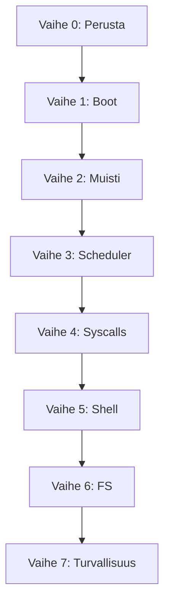

# Zinux — Kehitystiekartta

> Vaiheittainen suunnitelma tyhjästä bootattavaan hybridimikrokernel-käyttöjärjestelmään.
> Jokainen vaihe tuottaa **testattavan artefaktin** (QEMU boot + serial output).

---

## Vaihe 0 — Perusta ✅

| Tehtävä | Tila |
|---------|------|
| Arkkitehtuuridokumentaatio | ✅ |
| Ylidokumentointistandardi | ✅ |
| Projektirakenne & build.zig runko | ✅ |
| Limine + linker.ld konfiguraatio | ✅ |
| Dokumentoitu entry point -esimerkki | ✅ |

---

## Vaihe 1 — Boot & tulostus ✅

**Tavoite**: Kernel boottaa Liminessä, tulostaa "Zinux boot OK" UART/VGA:han.

| # | Tehtävä | Tiedosto | Tila |
|---|---------|----------|------|
| 1.1 | Limine request/response | `kernel/boot/limine_protocol.zig` | ✅ |
| 1.2 | `_start` entry + early stack | `kernel/boot/entry.zig` | ✅ |
| 1.3 | VGA text mode -ajuri | `kernel/drivers/video/vga.zig` | ✅ |
| 1.4 | UART COM1 debug -ajuri | `kernel/drivers/char/uart.zig` | ✅ |
| 1.5 | Log-moduuli (serial + vga) | `kernel/lib/log.zig` | ✅ |
| 1.6 | ISO-build + QEMU-run step | `build.zig` | ✅ |
| 1.7 | CI: boot-test "Zinux boot OK" | `.github/workflows/ci.yml` | ✅ |

**Testi**:
```bash
zig build iso && zig build run
# Odotettu serial: [Zinux] boot OK
```

---

## Vaihe 2 — Muistinhallinta ✅

**Tavoite**: Fyysinen ja virtuaalinen muistinhallinta toimii; kernel heap allokoi.

| # | Tehtävä | Tiedosto | Tila |
|---|---------|----------|------|
| 2.1 | GDT + TSS | `kernel/arch/x86_64/gdt.zig` | ✅ GDT (TSS myöhemmin) |
| 2.2 | IDT + keskeytyskäsittelijät | `kernel/arch/x86_64/idt.zig` | ✅ stub + #14 |
| 2.3 | 4-tasoinen sivutus | `kernel/arch/x86_64/paging.zig` | ✅ mapPage + mapPageEnsure |
| 2.4 | PMM bitmap-allokaattori | `kernel/mm/pmm.zig` | ✅ Limine map + host-testit |
| 2.5 | VMM sivukartoitus | `kernel/mm/vmm.zig` | ✅ PMM-sivutaulut + mapNewPageEnsure |
| 2.6 | Kernel heap (first-fit) | `kernel/mm/heap.zig` | ✅ heap_core + VMM-kasvu |
| 2.7 | Page fault -handler | `kernel/arch/x86_64/idt.zig` | ✅ CR2 + error code log |

**Testi**: Allokoi 100 kehystä, kartoita, kirjoita, lue — ei page faultia. ✅

**Boot**:
```bash
zig build run
# Odotettu serial:
# PMM initialized, PMM alloc test OK, VMM initialized, Heap initialized
# Memory map test OK (100 frames), Heap test OK, Zinux boot OK
```

---

## Vaihe 3 — Prosessit & aikataulutus ✅

**Tavoite**: Useita säikeitä, kontekstinvaihto, PIT-ajastin.

| # | Tehtävä | Tiedosto | Tila |
|---|---------|----------|------|
| 3.1 | CPU-konteksti (save/restore) | `kernel/arch/x86_64/context.zig` | ✅ RSP switch |
| 3.2 | Prosessi & säie -rakenteet | `kernel/sched/thread.zig` | ✅ stub |
| 3.3 | Round-robin scheduler | `kernel/sched/scheduler.zig` | ✅ coop ABAB-demo |
| 3.4 | PIT 8254 -ajastin | `kernel/drivers/timer/pit.zig` | ✅ |
| 3.5 | Timer IRQ → scheduler tick | `kernel/arch/x86_64/idt.zig` | ✅ PIT IRQ + Phase 3 timer ticks OK |
| 3.6 | SMP per-CPU init (Limine) | `kernel/boot/smp.zig` | ✅ CPU-määrä boot-logissa |

**Testi**: Kaksi säiettä vuorottelevat tulostusta → `ABAB...` serialissa ✅

---

## Vaihe 4 — Syscalls & IPC ✅

**Tavoite**: Käyttäjätilan prosessi voi kutsua kerneliä; capability-malli.

| # | Tehtävä | Tiedosto | Tila |
|---|---------|----------|------|
| 4.1 | Syscall entry (syscall/sysenter) | `kernel/arch/x86_64/syscall.zig` | ✅ STAR/LSTAR/SFMASK + entry.S |
| 4.2 | Syscall dispatch -taulu | `kernel/syscall/dispatch.zig` | ✅ write/exit/getpid + boot-testi |
| 4.3 | Capability-rakenne | `kernel/ipc/capability.zig` | ✅ create/delegate/revoke + boot-testi |
| 4.4 | IPC-portit (send/recv) | `kernel/ipc/port.zig` | ✅ rengasjono + cap send/recv + boot-testi |
| 4.5 | Ring 3 siirtymä | `kernel/arch/x86_64/usermode.zig` | ✅ iretq + SYSCALL hello + test_return |
| 4.6 | Jaettu ABI | `libs/zinuxabi.zig` | ✅ syscall-numerot + virhekoodit |

**Testi**: Ring 3 `sys_write("hello")` → serial + `Usermode test OK` ✅

---

## Vaihe 5 — Käyttäjätila ✅

**Tavoite**: Init-prosessi, shell, peruskomennot.

| # | Tehtävä | Tiedosto |
|---|---------|----------|
| 5.1 | ELF-loader kernelissä | `kernel/loader/elf.zig` | ✅ parse PT_LOAD + boot "elf" |
| 5.2 | init-prosessi | `userland/init/main.zig` | ✅ ELF load + "init\n" + Init process OK |
| 5.3 | Interaktiivinen shell | `userland/shell/main.zig` | ✅ prompt + help + Shell test OK |
| 5.4 | PS/2-näppäimistö | `kernel/drivers/char/keyboard.zig` | ✅ IRQ1 + Keyboard init/test OK |
| 5.5 | Komennot: help, meminfo, ps | `userland/shell/commands/` | ✅ SYS_meminfo/ps + boot test OK |

**Testi**: Boot → shell prompt `zinux> ` → `help` / `meminfo` / `ps` toimivat.

---

## Vaihe 6 — Ajurit & tiedostojärjestelmä

**Tavoite**: PCI-enumerointi, virtio-blk, yksinkertainen FS.

| # | Tehtävä | Tiedosto |
|---|---------|----------|
| 6.1 | PCI bus scan | `kernel/drivers/bus/pci.zig` |
| 6.2 | VirtIO block -ajuri | `kernel/drivers/block/virtio_blk.zig` |
| 6.3 | VFS-rajapinta | `kernel/fs/vfs.zig` |
| 6.4 | tmpfs (RAM-pohjainen) | `kernel/fs/tmpfs.zig` |
| 6.5 | Käyttäjätilan ajurimalli | `userland/drivers/` |

---

## Vaihe 7 — Turvallisuus & kovennus

| # | Tehtävä |
|---|---------|
| 7.1 | SMEP/SMAP aktivointi |
| 7.2 | Stack canaries kernelissä |
| 7.3 | KASLR (satunnainen kernel-base) |
| 7.4 | Capability-audit logging |
| 7.5 | Fuzzing: syscall-rajapinta |

---

## Riippuvuudet vaiheiden välillä



---

## Mittarit

| Vaihe | LOC (arvio) | Boot-aika | Testit |
|-------|-------------|-----------|--------|
| 0 | ~500 | — | docs review |
| 1 | ~2 000 | <1 s | 1 integration |
| 2 | ~5 000 | <1 s | 5 unit + 2 integration |
| 3 | ~8 000 | <1 s | 10 unit + 3 integration |
| 4 | ~12 000 | <2 s | 15 unit + 5 integration |
| 5 | ~18 000 | <2 s | 20 unit + 8 integration |

*LOC sisältää ylidokumentointikommentit (~40 % koodista).*
