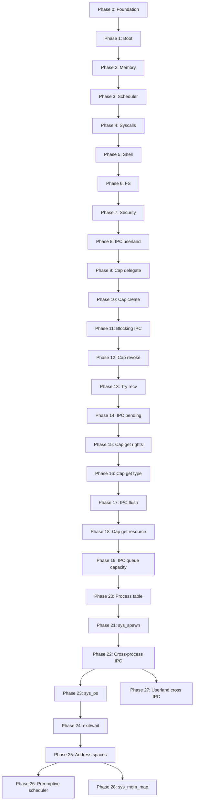

# Zinux — Development Roadmap

> Step-by-step plan from scratch to a bootable hybrid microkernel operating system.
> Each phase produces a **testable artifact** (QEMU boot + serial output).

---

## Phase 0 — Foundation ✅

| Task | Status |
|------|--------|
| Architecture documentation | ✅ |
| Over-documentation standard | ✅ |
| Project structure & build.zig skeleton | ✅ |
| Limine + linker.ld configuration | ✅ |
| Documented entry point example | ✅ |

---

## Phase 1 — Boot & Output ✅

**Goal**: Kernel boots in Limine, prints "Zinux boot OK" to UART/VGA.

| # | Task | File | Status |
|---|------|------|--------|
| 1.1 | Limine request/response | `kernel/boot/limine_protocol.zig` | ✅ |
| 1.2 | `_start` entry + early stack | `kernel/boot/entry.zig` | ✅ |
| 1.3 | VGA text mode driver | `kernel/drivers/video/vga.zig` | ✅ |
| 1.4 | UART COM1 debug driver | `kernel/drivers/char/uart.zig` | ✅ |
| 1.5 | Log module (serial + vga) | `kernel/lib/log.zig` | ✅ |
| 1.6 | ISO-build + QEMU-run step | `build.zig` | ✅ |
| 1.7 | CI: boot-test "Zinux boot OK" | `.github/workflows/ci.yml` | ✅ |

**Test**:
```bash
zig build iso && zig build run
# Expected serial: [Zinux] boot OK
```

---

## Phase 2 — Memory Management ✅

**Goal**: Physical and virtual memory management works; kernel heap allocates.

| # | Task | File | Status |
|---|------|------|--------|
| 2.1 | GDT + TSS | `kernel/arch/x86_64/gdt.zig` | ✅ GDT (TSS later) |
| 2.2 | IDT + interrupt handlers | `kernel/arch/x86_64/idt.zig` | ✅ stub + #14 |
| 2.3 | 4-level paging | `kernel/arch/x86_64/paging.zig` | ✅ mapPage + mapPageEnsure |
| 2.4 | PMM bitmap allocator | `kernel/mm/pmm.zig` | ✅ Limine map + host tests |
| 2.5 | VMM page mapping | `kernel/mm/vmm.zig` | ✅ PMM page tables + mapNewPageEnsure |
| 2.6 | Kernel heap (first-fit) | `kernel/mm/heap.zig` | ✅ heap_core + VMM growth |
| 2.7 | Page fault handler | `kernel/arch/x86_64/idt.zig` | ✅ CR2 + error code log |

**Test**: Allocate 100 frames, map, write, read — no page fault. ✅

**Boot**:
```bash
zig build run
# Expected serial:
# PMM initialized, PMM alloc test OK, VMM initialized, Heap initialized
# Memory map test OK (100 frames), Heap test OK, Zinux boot OK
```

---

## Phase 3 — Processes & Scheduling ✅

**Goal**: Multiple threads, context switch, PIT timer.

| # | Task | File | Status |
|---|------|------|--------|
| 3.1 | CPU context (save/restore) | `kernel/arch/x86_64/context.zig` | ✅ RSP switch |
| 3.2 | Process & thread structures | `kernel/sched/thread.zig` | ✅ stub |
| 3.3 | Round-robin scheduler | `kernel/sched/scheduler.zig` | ✅ coop ABAB demo |
| 3.4 | PIT 8254 timer | `kernel/drivers/timer/pit.zig` | ✅ |
| 3.5 | Timer IRQ → scheduler tick | `kernel/arch/x86_64/idt.zig` | ✅ PIT IRQ + Phase 3 timer ticks OK |
| 3.6 | SMP per-CPU init (Limine) | `kernel/boot/smp.zig` | ✅ CPU count in boot log |

**Test**: Two threads alternate output → `ABAB...` in serial ✅

---

## Phase 4 — Syscalls & IPC ✅

**Goal**: User-mode process can call the kernel; capability model.

| # | Task | File | Status |
|---|------|------|--------|
| 4.1 | Syscall entry (syscall/sysenter) | `kernel/arch/x86_64/syscall.zig` | ✅ STAR/LSTAR/SFMASK + entry.S |
| 4.2 | Syscall dispatch table | `kernel/syscall/dispatch.zig` | ✅ write/exit/getpid + boot test |
| 4.3 | Capability structure | `kernel/ipc/capability.zig` | ✅ create/delegate/revoke + boot test |
| 4.4 | IPC ports (send/recv) | `kernel/ipc/port.zig` | ✅ ring buffer + cap send/recv + boot test |
| 4.5 | Ring 3 transition | `kernel/arch/x86_64/usermode.zig` | ✅ iretq + SYSCALL hello + test_return |
| 4.6 | Shared ABI | `libs/zinuxabi.zig` | ✅ syscall numbers + error codes |

**Test**: Ring 3 `sys_write("hello")` → serial + `Usermode test OK` ✅

---

## Phase 5 — Userland ✅

**Goal**: Init process, shell, basic commands.

| # | Task | File | Status |
|---|------|------|--------|
| 5.1 | ELF loader in kernel | `kernel/loader/elf.zig` | ✅ parse PT_LOAD + boot "elf" |
| 5.2 | init process | `userland/init/main.zig` | ✅ ELF load + "init\n" + Init process OK |
| 5.3 | Interactive shell | `userland/shell/main.zig` | ✅ prompt + help + Shell test OK |
| 5.4 | PS/2 keyboard | `kernel/drivers/char/keyboard.zig` | ✅ IRQ1 + Keyboard init/test OK |
| 5.5 | Commands: help, meminfo, ps | `userland/shell/commands/` | ✅ SYS_meminfo/ps + boot test OK |

**Test**: Boot → shell prompt `zinux> ` → `help` / `meminfo` / `ps` work.

---

## Phase 6 — Drivers & Filesystem ✅

**Goal**: PCI enumeration, virtio-blk, simple FS.

| # | Task | File | Status |
|---|------|------|--------|
| 6.1 | PCI bus scan | `kernel/drivers/bus/pci.zig` | ✅ config scan + PCI scan OK |
| 6.2 | VirtIO block driver | `kernel/drivers/block/virtio_blk.zig` | ✅ PCI common cfg + VirtIO block read OK |
| 6.3 | VFS interface | `kernel/fs/vfs.zig` | ✅ mount + open/read/close + VFS test OK |
| 6.4 | tmpfs (RAM-based) | `kernel/fs/tmpfs.zig` | ✅ /tmp/welcome + tmpfs test OK |
| 6.5 | Userland driver model | `userland/drivers/` | ✅ registry + null driver + Userland driver test OK |

---

## Phase 7 — Security & Hardening ✅

| # | Task | Status |
|---|------|--------|
| 7.1 | SMEP/SMAP activation | ✅ CR4 + stac/clac + SMEP/SMAP hardening OK |
| 7.2 | Stack canaries in kernel | ✅ early/syscall/TSS/thread + Stack canary OK |
| 7.3 | KASLR (random kernel base) | ✅ RDTSC+HHDM heap slide + KASLR OK |
| 7.4 | Capability-audit logging | ✅ ring buffer + Capability audit OK |
| 7.5 | Fuzzing: syscall interface | ✅ LCG fuzz + Syscall fuzz OK |

---

## Phase 8 — IPC to Userland ✅

**Goal**: Ring 3 can send/receive messages through capability slots via syscalls.

| # | Task | File | Status |
|---|------|------|--------|
| 8.1 | sys_ipc_send / sys_ipc_recv | `kernel/syscall/dispatch.zig`, `ipc_syscall_core.zig` | ✅ invoke + IPC syscall OK |
| 8.2 | Userland IPC library | `userland/lib/ipc.zig` | ✅ ring 3 send/recv + Userland IPC test OK |

**Test**:
```bash
zig build run
# Expected serial: IPC syscall OK, userland ipc OK, Userland IPC test OK
```

---

## Phase 9 — Capability Delegation to Userland ✅

**Goal**: Ring 3 can delegate capability rights via `sys_cap_delegate` syscall.

| # | Task | File | Status |
|---|------|------|--------|
| 9.1 | sys_cap_delegate | `kernel/syscall/dispatch.zig`, `cap_syscall_core.zig` | ✅ invoke + Cap syscall OK |
| 9.2 | Userland cap library | `userland/lib/cap.zig` | ✅ ring 3 delegate + Userland cap test OK |

**Test**:
```bash
zig build run
# Expected serial: Cap syscall OK, userland cap OK, Userland cap test OK
```

---

## Phase 10 — Capability Creation in Userland ✅

**Goal**: Ring 3 can create new IPC-port capabilities via `sys_cap_create` syscall.

| # | Task | File | Status |
|---|------|------|--------|
| 10.1 | sys_cap_create | `kernel/syscall/dispatch.zig`, `cap_syscall_core.zig` | ✅ invoke + Cap create syscall OK |
| 10.2 | Userland cap.createPort | `userland/lib/cap.zig` | ✅ ring 3 create + Userland cap create test OK |

**Test**:
```bash
zig build run
# Expected serial: Cap create syscall OK, userland cap create OK, Userland cap create test OK
```

---

## Phase 11 — Blocking IPC recv ✅

**Goal**: `sys_ipc_recv` blocks when port queue is empty; timer IRQ wakes waiting recv in boot test.

| # | Task | File | Status |
|---|------|------|--------|
| 11.1 | Blocking recv + timer-wake | `kernel/syscall/ipc_block_core.zig`, `ipc_block.zig`, `dispatch.zig` | ✅ IPC block OK |
| 11.2 | Userland blocking ipc.recv | `userland/ipc_block_test/`, `ipc_block_userland.zig` | ✅ userland ipc block OK |

**Test**:
```bash
zig build run
# Expected serial: IPC block OK, userland ipc block OK, Userland IPC block test OK
```

---

## Phase 12 — Capability Revocation in Userland ✅

**Goal**: Ring 3 can revoke its capability slots via `sys_cap_revoke` syscall.

| # | Task | File | Status |
|---|------|------|--------|
| 12.1 | sys_cap_revoke | `kernel/syscall/dispatch.zig`, `capability_core.zig` | ✅ invoke + Cap revoke syscall OK |
| 12.2 | Userland cap.revoke | `userland/lib/cap.zig`, `userland/cap_revoke_test/` | ✅ ring 3 revoke + Userland cap revoke test OK |

**Test**:
```bash
zig build run
# Expected serial: Cap revoke syscall OK, userland cap revoke OK, Userland cap revoke test OK
```

---

## Phase 13 — Non-blocking IPC recv ✅

**Goal**: Ring 3 can attempt message reception without blocking via `sys_ipc_try_recv` syscall (EAGAIN if queue empty).

| # | Task | File | Status |
|---|------|------|--------|
| 13.1 | sys_ipc_try_recv | `kernel/syscall/dispatch.zig`, `ipc_try_recv_syscall.zig` | ✅ invoke + IPC try recv syscall OK |
| 13.2 | Userland ipc.tryRecv | `userland/lib/ipc.zig`, `userland/ipc_try_recv_test/` | ✅ ring 3 tryRecv + Userland IPC try recv test OK |

**Test**:
```bash
zig build run
# Expected serial: IPC try recv syscall OK, userland ipc try recv OK, Userland IPC try recv test OK
```

---

## Phase 14 — IPC Queue Depth Query ✅

**Goal**: Ring 3 can query the number of messages in a capability slot's port queue via `sys_ipc_pending` syscall.

| # | Task | File | Status |
|---|------|------|--------|
| 14.1 | sys_ipc_pending | `kernel/syscall/dispatch.zig`, `port.zig` | ✅ invoke + IPC pending syscall OK |
| 14.2 | Userland ipc.pending | `userland/lib/ipc.zig`, `userland/ipc_pending_test/` | ✅ ring 3 pending + Userland IPC pending test OK |

**Test**:
```bash
zig build run
# Expected serial: IPC pending syscall OK, userland ipc pending OK, Userland IPC pending test OK
```

---

## Phase 15 — Capability Rights Query in Userland ✅

**Goal**: Ring 3 can read a capability slot's rights mask via `sys_cap_get_rights` syscall.

| # | Task | File | Status |
|---|------|------|--------|
| 15.1 | sys_cap_get_rights | `kernel/syscall/dispatch.zig`, `cap_get_rights.zig` | ✅ invoke + Cap get rights syscall OK |
| 15.2 | Userland cap.getRights | `userland/lib/cap.zig`, `userland/cap_get_rights_test/` | ✅ ring 3 getRights + Userland cap get rights test OK |

**Test**:
```bash
zig build run
# Expected serial: Cap get rights syscall OK, userland cap get rights OK, Userland cap get rights test OK
```

---

## Phase 16 — Capability Type Query and Port Release ✅

**Goal**: Ring 3 can read a capability slot's type via `sys_cap_get_type` syscall; port-capability revocation frees the IPC port.

| # | Task | File | Status |
|---|------|------|--------|
| 16.1 | sys_cap_get_type + port destroy on revoke | `dispatch.zig`, `capability_core.zig`, `cap_get_type.zig` | ✅ Cap get type syscall OK |
| 16.2 | Userland cap.getType | `userland/lib/cap.zig`, `userland/cap_get_type_test/` | ✅ userland cap get type OK |

**Test**:
```bash
zig build run
# Expected serial: Cap get type syscall OK, userland cap get type OK, Userland cap get type test OK
```

---

## Phase 17 — IPC Port Queue Flush ✅

**Goal**: Ring 3 can clear a capability slot's port message queue via `sys_ipc_flush` syscall without recv.

| # | Task | File | Status |
|---|------|------|--------|
| 17.1 | sys_ipc_flush | `kernel/syscall/dispatch.zig`, `port_core.zig`, `ipc_flush_syscall.zig` | ✅ invoke + IPC flush syscall OK |
| 17.2 | Userland ipc.flush | `userland/lib/ipc.zig`, `userland/ipc_flush_test/` | ✅ userland ipc flush OK |

**Test**:
```bash
zig build run
# Expected serial: IPC flush syscall OK, userland ipc flush OK, Userland IPC flush test OK
```

---

## Phase 18 — Capability Resource ID Query ✅

**Goal**: Ring 3 can read a capability slot's resource ID (e.g., port_id) via `sys_cap_get_resource` syscall; query requires read right.

| # | Task | File | Status |
|---|------|------|--------|
| 18.1 | sys_cap_get_resource | `dispatch.zig`, `capability_core.zig`, `cap_get_resource.zig` | ✅ Cap get resource syscall OK |
| 18.2 | Userland cap.getResource | `userland/lib/cap.zig`, `userland/cap_get_resource_test/` | ✅ userland cap get resource OK |

**Test**:
```bash
zig build run
# Expected serial: Cap get resource syscall OK, userland cap get resource OK, Userland cap get resource test OK
```

---

## Short-Term Plan (Phases 19–22) ✅

> **Priority**: first finish IPC introspection (19), then cross-process IPC (20–22).
> **Boot**: `zig build run` = smoke (~10 s), `zig build boot-test` = full integration tests (QEMU exits itself).

| Phase | Theme | Goal |
|-------|-------|------|
| **19** | IPC queue capacity | `pending` / `flush` / `queueCapacity` introspection trio | ✅ |
| **20** | Process table | Separate capability slots per pid | ✅ |
| **21** | Process creation | Second user-ELF into ring 3 (`sys_spawn`) | ✅ |
| **22** | Cross-process IPC | Message from process A → process B | ✅ |

---

## Medium-Term Plan (Phases 23–28)

> **Priority**: process management and introspection (23–24) → address spaces (25) → scheduler (26) → userland-IPC demo (27) → mmap (28).
> **Boot**: `zig build boot-test` = full integration test suite.

| Phase | Theme | Goal |
|-------|-------|------|
| **23** | Process list (`sys_ps`) | Real PIDs from process table + shell `ps` | ✅ |
| **24** | Process lifecycle | `sys_exit` + `sys_wait` (spawn → exit → wait) | ✅ |
| **25** | Address spaces | Separate page table / CR3 per process |
| **26** | Scheduler + processes | Timer preemption, multiple processes alternating |
| **27** | Cross-IPC userland | Spawn + cap_transfer + send/recv in ring 3 |
| **28** | Capability-mmap | `sys_mem_map` with memory-capability |

### Known fixes (security review, PR #2)

PR #2 branch security review (phases 20–22) found **2 medium findings**. Fixes are tied to the roadmap:

| ID | Severity | Location | Problem | Fix | Phase |
|----|----------|----------|---------|-----|-------|
| **S1** | Medium | `dispatch.zig:506`, `capability_core.zig` | `sys_cap_create` installs cap into **pid 1**, but slots are looked up with **`currentPid`** → wrong namespace / DoS pid ≥ 2 | `createAndInstall(..., process.currentPid(), ...)` | **23.0** ✅ |
| **S2** | Medium | `capability_core.zig:307`, `dispatch.zig:150` | `sys_cap_transfer` can fill victim's 32 slots with unlimited copies | Deduplication or move (not just copy) | **27.0** ⬜ |

**S1 attack path (fixed in phase 23):** process pid ≥ 2 calls `sys_cap_create` → cap was installed into pid 1 → `lookupSlot` searches current pid's table → slot index does not match correct cap / fills boot process slots.

**S2 attack path (planned):** process with grant-cap loops `sys_cap_transfer(victim_pid)` → victim's `MAX_SLOTS` fills → legitimate installs fail.

---

## Phase 19 — IPC Queue Capacity ✅

**Goal**: Ring 3 can query a capability slot's port maximum queue depth via `sys_ipc_queue_capacity` syscall (complements `pending` + `flush`).

| # | Task | File | Status |
|---|------|------|--------|
| 19.1 | sys_ipc_queue_capacity | `dispatch.zig`, `port_core.zig`, `ipc_queue_capacity_syscall.zig` | ✅ invoke + IPC queue capacity syscall OK |
| 19.2 | Userland ipc.queueCapacity | `userland/lib/ipc.zig`, `userland/ipc_queue_capacity_test/` | ✅ userland ipc queue capacity OK |

**Test**:
```bash
zig build run
# Expected serial: IPC queue capacity syscall OK, userland ipc queue capacity OK, Userland IPC queue capacity test OK
```

---

## Phase 20 — Process Table and Per-Process Capabilities ✅

**Goal**: Kernel separates capability slots per process; current single stub process (pid 1) expands into a process table.

| # | Task | File | Status |
|---|------|------|--------|
| 20.1 | Process structure + slots per pid | `kernel/sched/process.zig`, `capability_core.zig` | ✅ lookupSlotForPid(pid, slot) |
| 20.2 | Syscall context: current pid | `dispatch.zig`, `usermode.zig` | ✅ getpid returns current pid |
| 20.3 | Boot test: two processes in same table | host-tests + kernel smoke | ✅ Process table OK |

**Note**: Phase does not yet launch a second ELF — prepares for cross-process IPC.

---

## Phase 21 — Process Creation (sys_spawn) ✅

**Goal**: Kernel can launch a second user-ELF as its own process in ring 3 (ELF-loader + separate stack mapping).

| # | Task | File | Status |
|---|------|------|--------|
| 21.1 | sys_spawn(elf_path stub / embedded) | `kernel/syscall/spawn_syscall.zig`, `dispatch.zig` | ✅ Spawn syscall OK |
| 21.2 | Separate stack/map for second process | `loader/elf.zig`, `spawn.zig`, `process_core.zig` | ✅ Two processes boot OK |
| 21.3 | Userland spawn wrapper (optional) | `userland/lib/spawn.zig` | ✅ ring 3 spawn wrapper |

**Test**: Boot loads two lightweight test ELFs sequentially with different PIDs — both print to serial (`spa\n`, `spb\n`).

---

## Phase 22 — Cross-Process IPC ✅

**Goal**: Process A sends a message to process B's port through a capability; port-capability transferred/delegated to another process.

| # | Task | File | Status |
|---|------|------|--------|
| 22.1 | Capability transfer between processes | `capability_core.zig`, `sys_cap_transfer`, `dispatch.zig` | ✅ Cap transfer OK |
| 22.2 | IPC send/recv cross-pid | `port.zig`, `cross_ipc_syscall.zig` | ✅ Cross-process send OK |
| 22.3 | Boot test: A send → B recv | `cross_ipc_test/`, `cross_ipc_userland.zig` | ✅ Userland cross IPC test OK |

**Test**:
```bash
zig build boot-test
# Expected serial: Cap transfer OK, Cross-process send OK, Cross-process IPC syscall OK,
# userland cross ipc OK, Userland cross IPC test OK
```

---

## Phase 23 — Process List (`sys_ps`) ✅

**Goal**: `sys_ps` and shell `ps` show real processes from the process table (not hardcoded stub).

| # | Task | File | Status |
|---|------|------|--------|
| 23.0 | Security: `sys_cap_create` → `currentPid` | `dispatch.zig`, `capability_core.zig` | ✅ Cap create pid OK |
| 23.1 | `sys_ps` from process table | `dispatch.zig`, `ps_syscall_core.zig` | ✅ Ps syscall OK |
| 23.2 | Shell `ps` updated | `userland/shell/commands/ps.zig` | ✅ shell ps OK (sys_ps) |
| 23.3 | Boot test: multiple processes listed | `ps_syscall.zig`, host-tests | ✅ Ps lists processes OK |

**Test**:
```bash
zig build boot-test
# Expected serial: Cap create pid OK, Ps syscall OK, Ps lists processes OK
# Shell in boot test: ps prints correct PIDs (at least 1 boot, 2 proc)
```

---

## Phase 24 — Process Lifecycle (exit / wait) ✅

**Goal**: Spawned process can terminate itself; parent can wait for child (`sys_wait`).

| # | Task | File | Status |
|---|------|------|--------|
| 24.1 | Process state (running / zombie) | `process_core.zig` | ✅ Process state OK |
| 24.2 | `sys_exit` marks process zombie | `dispatch.zig` | ✅ Exit syscall OK |
| 24.3 | `sys_wait(pid)` — wait one child | `dispatch.zig`, `wait_syscall.zig` | ✅ Process wait OK |
| 24.4 | Boot test: spawn → exit → wait | `spawn.zig`, boot-tests | ✅ Spawn wait boot OK |

**Test**:
```bash
zig build boot-test
# Expected serial: Process state OK, Exit syscall OK, Process wait OK, Spawn wait boot OK
```

---

## Phase 25 — Per-Process Address Spaces ❓

**Goal**: Each process has its own page table (CR3); ELF-loader maps only into the process's address space.

| # | Task | File | Status |
|---|------|------|--------|
| 25.1 | `Process.page_table` + CR3 switch | `process_core.zig`, `vmm.zig` | ❓ VERIFY |
| 25.2 | ELF-loader into per-process table | `loader/elf.zig`, `spawn.zig` | ❓ VERIFY |
| 25.3 | Boot test: two ELFs at same VA, different processes | boot-tests | ❓ VERIFY |

**Test**:
```bash
zig build boot-test
# Expected serial: Page table per pid OK, Address space OK
```

**Dependency**: Recommended before full preemption (Phase 26) and before userland mmap (Phase 28).

> **AGENT NOTE**: Run `zig build boot-test`. If expected lines appear, change ❓ to ✅. If not, keep ❓ and implement before proceeding.

---

## Phase 26 — Scheduler + Processes ❓

**Goal**: Timer preemption switches processes; multiple ring-3 processes alternate (not just sequential `enterUserAs`).

| # | Task | File | Status |
|---|------|------|--------|
| 26.1 | Process → thread(s) in process table | `process_core.zig`, `thread.zig` | ❓ VERIFY |
| 26.2 | Timer IRQ → context switch | `scheduler.zig`, `idt.zig` | ❓ VERIFY |
| 26.3 | Boot test: two processes alternating | boot-tests | ❓ VERIFY |

**Test**:
```bash
zig build boot-test
# Expected serial: Timer preempt OK, Preempt OK (ABAB or similar alternation)
```

**Dependency**: Phase 25 (separate address spaces) recommended before full preemption.

> **AGENT NOTE**: Run `zig build boot-test`. If expected lines appear, change ❓ to ✅. If not, keep ❓ and implement before proceeding.

---

## Phase 27 — Cross-Process IPC Userland Demo ❓

**Goal**: Userland process spawns another, transfers recv-capability, send → recv without kernel orchestration.

| # | Task | File | Status |
|---|------|------|--------|
| 27.0 | Security: `sys_cap_transfer` deduplication / move | `capability_core.zig` | ❓ VERIFY |
| 27.1 | `userland/lib/spawn.zig` + `cap.transfer()` demo | `userland/lib/` | ❓ VERIFY |
| 27.2 | Parent spawn → transfer → child recv | `userland/cross_spawn_ipc_test/` | ❓ VERIFY |
| 27.3 | Boot test in ring 3 | kernel launcher + ELF | ❓ VERIFY |

**Test**:
```bash
zig build boot-test
# Expected serial: Cap transfer bounded OK, Userland cross spawn IPC OK, Userland cross spawn IPC test OK
```

> **AGENT NOTE**: Run `zig build boot-test`. If expected lines appear, change ❓ to ✅. If not, keep ❓ and implement before proceeding.

---

## Phase 28 — Capability-Based mmap (`sys_mem_map`) ❓

**Goal**: Memory-capability + `sys_mem_map` maps a single page into ring 3 (see ARCHITECTURE.md §6).

| # | Task | File | Status |
|---|------|------|--------|
| 28.1 | Memory-capability type | `capability_core.zig`, `zinuxabi.zig` | ❓ VERIFY |
| 28.2 | `sys_mem_map(slot, addr, flags)` | `dispatch.zig`, `mem_map_syscall.zig` | ❓ VERIFY |
| 28.3 | Userland demo: write/read mapped page | `userland/mem_map_test/` | ❓ VERIFY |

**Test**:
```bash
zig build boot-test
# Expected serial: Mem map syscall OK, Userland mem map OK, Userland mem map test OK
```

**Dependency**: Phase 25 (per-process page table) recommended before userland mmap.

> **AGENT NOTE**: Run `zig build boot-test`. If expected lines appear, change ❓ to ✅. If not, keep ❓ and implement before proceeding.

---

## Inter-Phase Dependencies



---

## Metrics

| Phase | LOC (estimate) | Boot time | Tests |
|-------|----------------|-----------|-------|
| 0 | ~500 | — | docs review |
| 1 | ~2 000 | <1 s | 1 integration |
| 2 | ~5 000 | <1 s | 5 unit + 2 integration |
| 3 | ~8 000 | <1 s | 10 unit + 3 integration |
| 4 | ~12 000 | <2 s | 15 unit + 5 integration |
| 5 | ~18 000 | <2 s | 20 unit + 8 integration |

*LOC includes over-documentation comments (~40% of code).*
